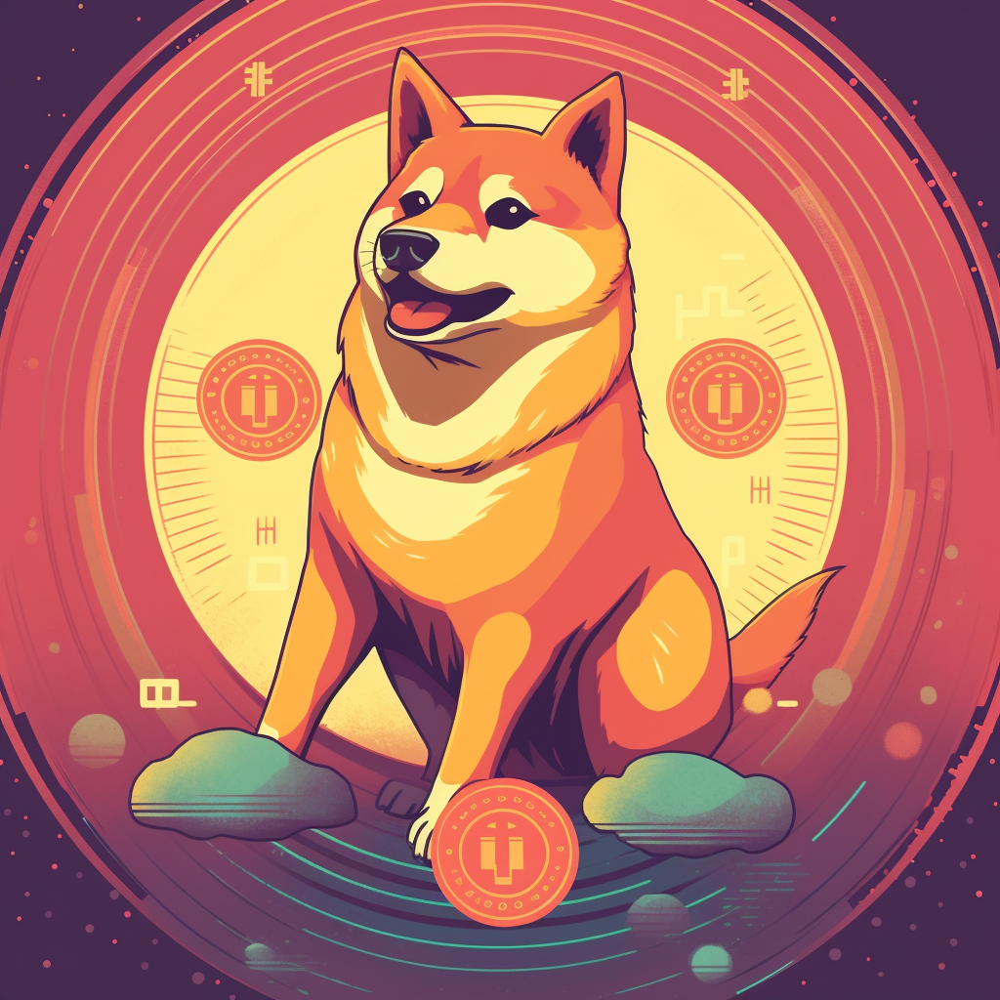

# Overview

<figure><figcaption></figcaption></figure>

D20Swap is the first swap protocol developed to provide liquidity to the DRC-20 ecosystem based on the [Unielon](https://www.unielon.com) protocol.&#x20;

D20Swap is dedicated to solving the lack of liquidity in DRC20 by increasing the liquidity pool for LP transactions and enabling real-time trading. Also, to reduce the complexity of DRC token trading and enable users to buy, sell and add liquidity pools more easily, BisoSwap attempts to bring the Doge network to the use of the LP model for the first time, allowing for more diversified use of Doge assets.
